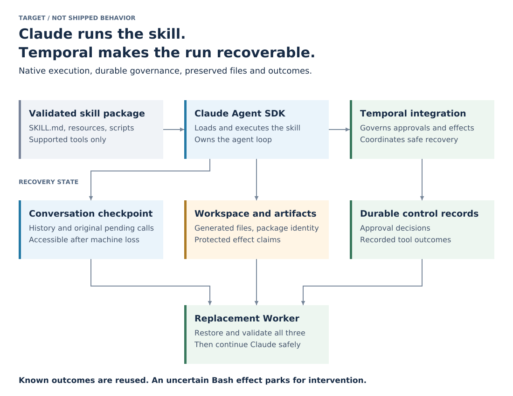

# Recoverable Claude skills on Temporal

This development fork extends the Claude Agent SDK integration so a validated Claude skill package can run unmodified as a governed, recoverable Temporal operation. Claude owns skill loading and the agent loop. The integration must preserve the state needed to continue safely after a failure.

The end goal is a reusable integration that works inside an application authored Temporal Workflow and can be adapted into [temporal-agent-harness](https://github.com/temporal-community/temporal-agent-harness). It is not a standalone replacement for either Claude or Temporal, and it must not require callers to rewrite a skill as a new agent loop.

## Target outcome



The diagram is a target responsibility map, not a claim that these capabilities are implemented. It was rendered with Cairo. The three state classes are responsibilities, not a requirement to deploy three databases.

- Run a validated package containing `SKILL.md`, resources and scripts through Claude's native skill support, with a defined supported tool set.
- Preserve pending human questions and approvals across Worker replacement and long waits. Bind each answer to the original request.
- Reuse recorded tool outcomes during recovery without executing the same completed effect again.
- Preserve generated files, package identity and protected effect claims. Conversation history alone does not restore the filesystem.
- Continue only after recovery state and exclusive session ownership are validated. An uncertain Bash outcome parks for intervention; it does not authorize another spawn or model continuation.
- Expose reusable execution, state and policy boundaries for ordinary Temporal Workflows and a later harness adapter. Prove the integration first, then prove the harness adapter separately.

## Current status

The [scoped permission closure](python/claude_agent_sdk/docs/skill-recovery/evidence.md#scoped-permission-backstop-closure-2026-10-05) owns the completed preventive proof and its pinned configuration limits. Policy construction and coordination are complete. Next is package validation/read confinement; the engine exit review remains mandatory before Phase 2.

[Production result delivery is complete](python/claude_agent_sdk/docs/skill-recovery/evidence.md#production-result-delivery-closure-2026-10-05): all eight accepted criteria are demonstrated. Exact original Write success and Bash error return on fresh production Workers without repeated effects, after accepted segment commit and authoritative cleanup. Mixed denial visibility and Read ordering/model next action are proved. Historical failures and reservations remain preserved; skill validation and the engine exit review remain required before Phase 2.

The [bounded real model harness is complete](python/claude_agent_sdk/docs/skill-recovery/evidence.md#bounded-real-model-harness-closure-2026-10-05). Its existing evidence owns runtime versions, monitored allowances and complete recording. Closure does not authorize further live calls or bypass the remaining Phase 1 work and exit review.

Experimental and incomplete. The original plugin supplies durable custom tools and session checkpoints. This fork adds an opt in built in tool policy and an offline harness. Leaving the policy unset retains the original behavior.

The policy branch validates its table and options, defers supported effects and questions, and stops when it has no executor. The effect executor, validated skill loading and signed question handler are not implemented. It cannot yet complete an effectful coding skill. Offline tests are not proof of real model interception, replacement Worker recovery or complete filesystem preservation. The [plugin README](python/claude_agent_sdk/README.md) describes the implemented API and its limits.

## Recovery direction

The recommended first investigation is the long running CLI hybrid approach and its experimental SDK main agent recovery support. It recovers original pending calls before a replacement CLI starts and reuses recorded outcomes, which directly matches the target above. This is a research priority, not an adopted implementation or a released SDK guarantee. The current defer and synthetic result path remains the implemented baseline until the comparison supports an explicit adoption decision.

Claude Code Mods are a candidate interception mechanism, not a substitute for recovery storage or effect safety. Their hook failure contract allows underlying execution to continue when a hook throws, exceeds its budget or returns a wrong shape. Any adopted route needs an independent preventive control and tests of actual SDK loading and interception coverage.

The bounded comparison must establish original call identity, recorded result delivery, pending approval recovery, exclusive session ownership, orphan process handling and a replacement Worker's access to the required files. It must also inject a crash after an effect but before outcome recording. Candidates that cannot meet the offered scope are rejected; source examples do not count as this fork's runtime proof.

Primary references:

- [Native SDK skills](https://code.claude.com/docs/en/agent-sdk/skills) and [sessions versus filesystem state](https://code.claude.com/docs/en/agent-sdk/sessions).
- [Pinned hybrid recovery prototype and its supported scope](https://github.com/temporalio/ai-integrations/blob/2ab873cc23a1b3224531a5634c1f6d1c8ef0ea1f/python/claude_agent_sdk/README.md#L525), including its experimental SDK dependency and host responsibilities.
- [Official Mods announcement](https://claude.dev/blog/getting-started-with-claude-code-mods/) and [pinned hook failure contract](https://github.com/anthropics/claude-code/blob/52c76441cae91f6891e4712306bffb057ff6fec5/mods/types/claude-code.d.ts#L3236).

## Upstream integration collection

This fork retains the upstream repository layout and the other integrations. The catalog and development conventions below describe that collection, not completed skill recovery features or a release of this fork's changes.

Plugins that connect AI agent frameworks and SDKs to [Temporal](https://temporal.io) durable
execution. Each plugin is its own package with its own dependencies, tests, version and release
cadence, laid out as `<language>/<integration>/`.

| Plugin | Package | Root API | Maturity |
|---|---|---|---|
| [`python/claude_agent_sdk`](python/claude_agent_sdk) | [`temporalio-claude-agent-sdk`](https://pypi.org/project/temporalio-claude-agent-sdk/) | `temporalio.claude_agent_sdk` | Experimental |
| [`python/mcp`](python/mcp) | [`temporalio-mcp`](https://pypi.org/project/temporalio-mcp/) | `temporalio.mcp` | Experimental |
| [`python/openai_agents`](python/openai_agents) | [`temporalio-openai-agents`](https://pypi.org/project/temporalio-openai-agents/) | `temporalio.openai_agents` | GA |

More plugins are migrating here from the SDK repositories; see the target table in
[`AGENTS.md`](AGENTS.md).

## Install

```
$ uv add temporalio-claude-agent-sdk
$ uv add temporalio-mcp
$ uv add temporalio-openai-agents
```

## Develop

```
$ cd python/openai_agents
$ make sync    # non-editable install into .venv (see AGENTS.md for why)
$ make lint
$ make test    # provider calls use deterministic local models and transports
```

`make help` lists every target. Conventions, CI design, release process and migration procedure
are in [`AGENTS.md`](AGENTS.md); contributor workflow is in [`CONTRIBUTING.md`](CONTRIBUTING.md).

## License

[MIT](LICENSE). Each plugin directory carries an identical copy so every published package ships the license text.
